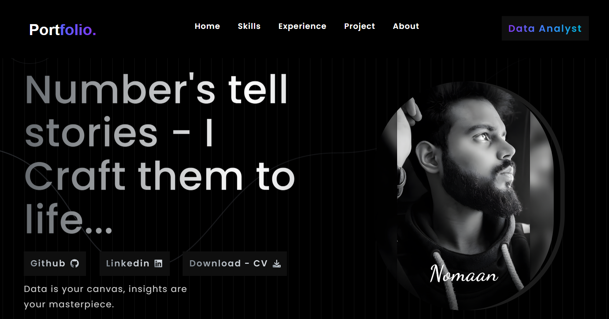

   
   
  
   

  <h2 align="center">Dexter Cosmos - Personal Portfolio Website</h2>

  Dexter Cosmos is a fully responsive personal portfolio website,  Responsive for all devices, build using HTML, CSS, and JavaScript.

## Introduction

This is a personal portfolio website for Dexter Cosmos, showcasing projects and skills.

## Features

- Fully responsive design
- Modern and clean layout
- Easy to navigate

### Portfolio live

urls=(
    "https://porfolio-d6ty.vercel.app"
    "https://nomaan-portfolio.vercel.app"
    "https://porfolio-d6ty-dexter-porfolio.vercel.app"
)

# Loop through the URLs and open each one
for url in "${urls[@]}"; do
    echo "Opening $url"
    xdg-open "$url" 2>/dev/null || open "$url" 2>/dev/null || start "$url"
done